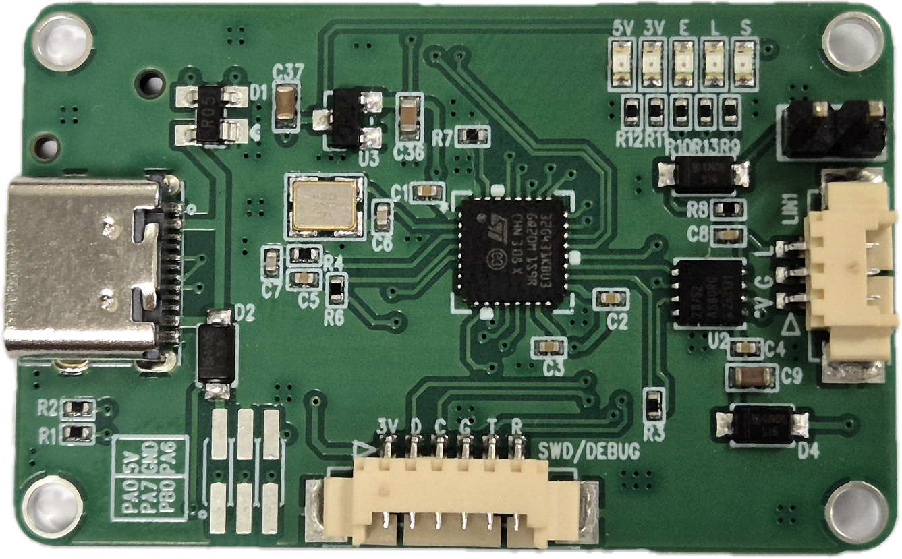

# STM32G4-LIN
STM32G4 기반 USB to LIN 통신 모듈

SLCAN 기반 통신 프로토콜 지원(COM 포트 인식)

https://github.com/uCAN-LIN/LinUSBConverter 기반으로 구성됨

### 개발환경
- CubeIDE 버전: 1.16.0 

### 기능
- MCU: STM32G431KBU6(ARM Cortex M4, 최대 170Mhz 구동)
- SRAM: 32KB
- ROM: 128KB
- LIN 트랜시버: NXP TJA1028TK
- 입력 전압: 12V(린 통신 필요 없을 시 USB 5V 가능)
- 외부 확장 핀: 4개
- 보드 사이즈: 43 x 27mm